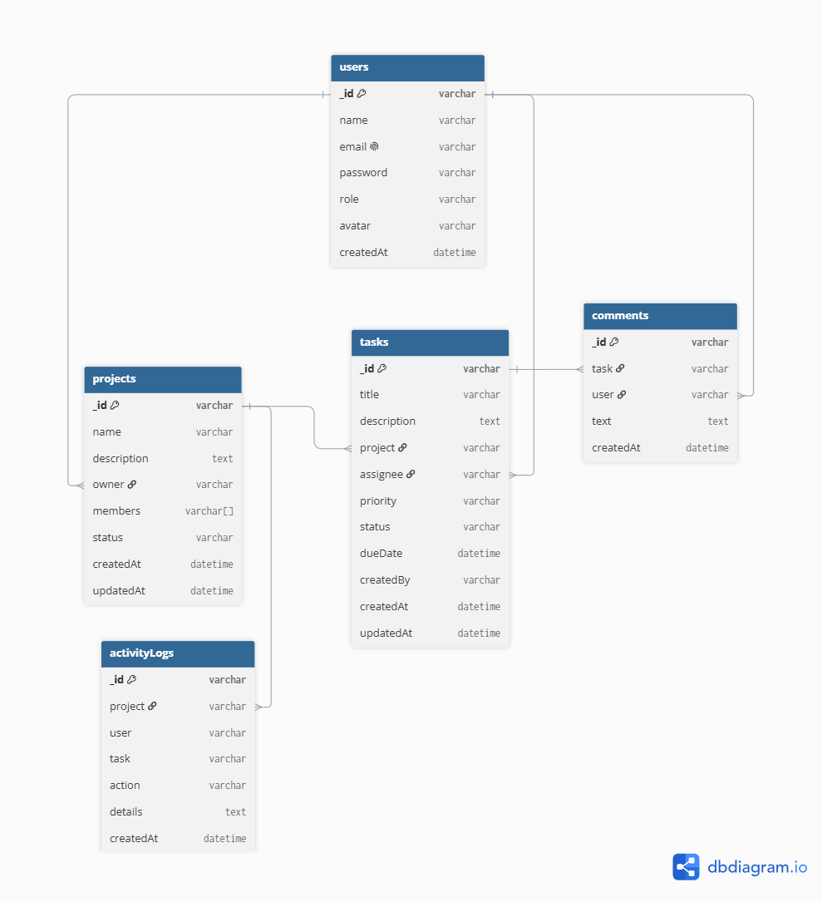

# TaskMatrix

TaskMatrix is a full-stack project management application for software development teams. It helps teams create projects, assign tasks, track progress, manage deadlines, and communicate through comments.

The main idea is to provide a simple workspace where a team can manage their development work using a Kanban board.

## Project Track

**Fullstack Development**

## Tech Stack

### Frontend

* React
* Vite
* Tailwind CSS
* Shadcn UI
* React Router
* Redux Toolkit

### Backend

* Node.js
* Express.js
* MongoDB
* Mongoose
* JWT
* Socket.IO

### Tools

* Git & GitHub
* Postman
* Figma
* dbdiagram.io

### Deployment

* Render

## Core Features

### Authentication

* User registration and login
* JWT authentication
* Protected routes

### Project Management

* Create and manage projects
* Add team members
* Manage project members and roles

### Task Management

* Create, update and delete tasks
* Assign tasks to team members
* Set task priority
* Set deadlines
* Update task status

### Kanban Board

Tasks will be managed through:

Backlog → To Do → In Progress → Review → Done

### Comments

* Add comments to tasks
* View task discussions

### Activity Feed

* Track important project and task changes
* Show recent activity

### Dashboard

* View projects
* View assigned tasks
* See task statistics
* Check upcoming and overdue tasks

## User Roles

TaskMatrix will have three main roles:

* **Admin** – Can manage projects, members and tasks.
* **Developer** – Can work on assigned tasks and collaborate with the team.
* **Viewer** – Can view project and task information but cannot make changes.

## Database

The application will use MongoDB.

Planned collections:

* Users
* Projects
* Tasks
* Comments
* ActivityLogs

The relationships between these collections will be shown in the ERD.

## UI/UX Design

The application will be designed in Figma before development.

Planned screens:

* Login / Register
* Dashboard
* Projects
* Kanban Board
* Task Details
* Mobile Responsive View

## UI/UX Design

The UI/UX designs were created in Figma with desktop and mobile layouts.

**Figma:** [TaskMatrix UI/UX Design](https://www.figma.com/design/7BrU1lnSGpVNRziMI8sX1w/TaskMatrix---UI-UX-Design?node-id=1-2&t=RQFPNCIaJZEYhNpp-1)

## Architecture

The basic application flow will be:

React Frontend → Express API → MongoDB

Socket.IO will be used later for real-time activity updates.

### ERD

## Future Features

The following features may be added after the main application is completed:

* AI-assisted task creation
* Dark mode
* More real-time features

## Project Status

**Sprint 13 – Planning & Architecture**

- [x] Project selection
- [x] Project scope
- [x] Core features
- [x] Tech stack
- [x] Figma design
- [x] Database schema
- [x] ERD
- [x] API planning
- [x] Prompts.md
- [ ] Application development
- [ ] Deployment 